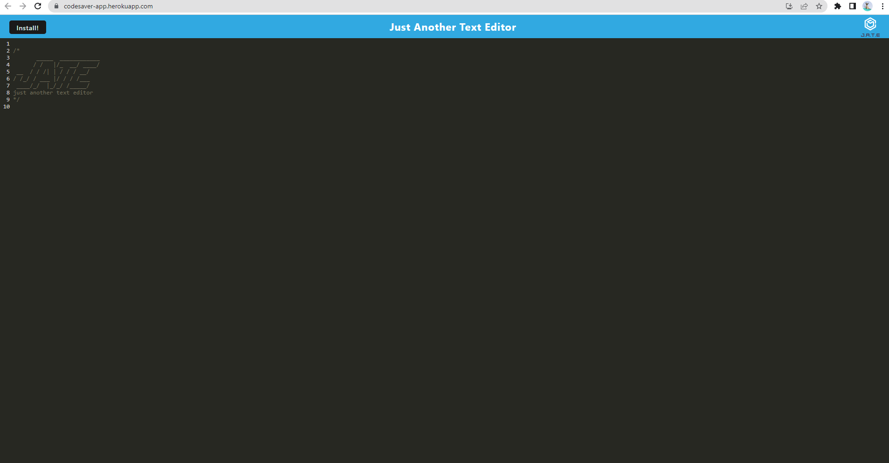

# Text-Editor
challenge 19

## Description
For this project we wanted to great an app that gives the user the ability to store code snippets. When the user enters a code it saves to to not only local storage but a database created in web. The database allows the user to store their data and reload it when they refresh the page. This also allows the users to go offline and save some data. When the user clicks install the webpage becomes an app independent of the browser where the user can continue to add code snippets and save it to the IndexedDB. This app uses verious webpack plug-ins to create the functionality we wanted to have for this app.

## Table of Contents
* [Installation](#installation)
* [Usage](#usage)
* [Contributing](#contributing)
* [Instructions](#instructions)
* [License](#license)
* [Questions](#questions)

## Installation
npm install in root package.json, not client or server package.json, to install each package concurrently using the devDependencies add on.

## Usage

A link to heroku deployed app is provided here: [Heroku](https://codesaver-app.herokuapp.com/)

## Contributing
Thanks to the teacher, TA's and classmates for help on this project.

## Tests
none

## License
none

## Questions
If you have anyquestions don't hesitate to contact us with the information listed below.

You can find our GitHub here: [GitHub](https://github.com/sweetkloid/Text-Editor)

You can email us here: coolstrawberries@gmail.com